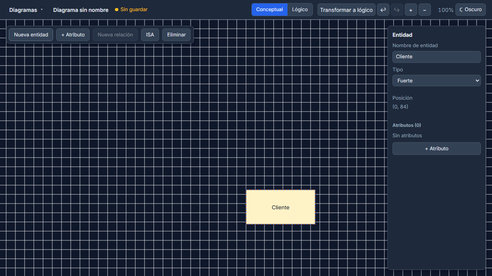

# ERD Studio

Motor de diseño visual de **diagramas Entidad–Relación en notación Chen** para el modelado conceptual de bases de datos, con **transformación automática al modelo lógico** (tablas, columnas y claves foráneas).

Editor de mesa completa (drag libre de nodos y atributos, snapping a grilla, render a 60 fps), multi-diagrama con autosave y resolución de conflictos, clipboard de ramas, undo/redo y un lienzo lógico derivado que el usuario completa con tipos de datos.

> Referencia funcional: **ERDPlus** (estudio de funcionalidad del editor conceptual). No se copia su implementación ni su diseño; es una implementación propia, fría y profesional.

## Vista previa del render



Captura generada por la suite de regresión visual (Playwright) — baselines commiteados en `client/e2e/visual/__screenshots__/`.

## Características

### Editor conceptual (notación Chen)
- **Entidades** fuertes y débiles (rectángulo de borde doble) con esquinas redondeadas y relleno con gradiente.
- **Atributos** simples, compuestos, multivaluados (doble elipse) y derivados (elipse discontinua); claves subrayadas.
- **Relaciones** binarias y n-arias (rombos) con cardinalidad `1/N/M`, participación **total** (línea doble) / **parcial**, roles y relación identificadora (rombo doble).
- **Especialización ISA**: disjunta (`D`) / solapada (`O`), total / parcial.
- **Atributos de relación** y modelos recursivos (rol obligatorio en cada extremo).

### Interacción y rendimiento
- **Arrastre libre** de nodos —incluidos los atributos, que siguen a su entidad— con preview en vivo, snapping a grilla de 20 px y render querúrgico durante el drag (60 fps objetivo, medido en CI).
- **Undo/redo** por historial de comandos con fallback a snapshots.
- Menú contextual, inspector contextual por selección, paleta de atajos (`Ctrl+Shift+?`) y atajos de teclado completos.
- Temas **dark/light** certificados AA (WCAG 2.2), foco visible, `prefers-reduced-motion` y navegación accesible por teclado.

### Modelo lógico
- **Transformación Conceptual → Lógico** determinista y explicable: IDs estables (`TableId`/`ColumnId`), naming `snake_case` con manejo de colisiones y trazabilidad (`derivedFrom` en cada columna).
- Los datos no inferibles quedan como `No definido` (`UNDEFINED`) y se completan a mano en el lienzo lógico.
- Recomprobación de derivación cuando se editan tipos (`recompute`).

### Persistencia multi-diagrama
- Dashboard con CRUD completo (crear, renombrar, duplicar, eliminar con confirmación, soft-delete).
- **Autosave** con debounce de 1500 ms y guardado inmediato al cambiar de diagrama o salir (`Ctrl+S`, `beforeunload` con `fetch keepalive`).
- **Conflictos 409** resueltos sin pérdida: *Recargar remoto*, *Conservar local* o *Sobrescribir remoto*.
- **Clipboard de ramas** (copy/cut/paste) dentro y entre diagramas: payload MIME propio versionado, re-mapeo de IDs y auto-renombre por colisión.

## Pila técnica

| Capa | Tecnología |
|---|---|
| **shared** | Dominio puro en TypeScript: modelo, comandos (reducers inmutables), validación, serialización y transformación. **Cero dependencias runtime**. |
| **client** | React 18 + Vite, Zustand, React Router 7 (data router). Editor engine y renderer SVG propios, **sin DOM ni React dentro del engine** (`editor/` + `render/` son TS puro). |
| **server** | Node.js 20 + Fastify 5, `better-sqlite3` (síncrono, transaccional), Schemas TypeBox, CORS / rate-limit / static. |
| **testing** | Vitest (unit + cobertura) y Playwright (E2E, rendimiento y regresión visual). |

Monorepo **npm workspaces** · TypeScript estricto (`strict`, ES2022, ESM) · ESLint flat config + Prettier.

## Requisitos

- **Node.js 20 LTS** o superior.
- npm 10+.

## Puesta en marcha

```bash
cd Project
npm ci
```

### Desarrollo (dos terminales)

```bash
# Terminal 1 — servidor API + persistencia (http://localhost:3001)
npm run dev -w @erd-studio/server

# Terminal 2 — cliente Vite con HMR (http://localhost:5173)
npm run dev -w @erd-studio/client
```

El dev server de Vite redirige `/api/*` al servidor (`VITE_API_PROXY` para apuntar a otra URL).

### Producción (mismo origen)

```bash
cd Project
npm run build -w @erd-studio/client   # genera client/dist
NODE_ENV=production npm run start -w @erd-studio/server
```

Con `NODE_ENV=production` el servidor sirve la API **y** el build del cliente desde el mismo origen con CSP y cabeceras de seguridad activas.

## Configuración del servidor

| Variable | Default | Descripción |
|---|---|---|
| `PORT` | `3001` | Puerto HTTP. |
| `DB_PATH` | `<server>/data/erd-studio.db` | Ruta del fichero SQLite (se crea con las migraciones al arrancar). |
| `NODE_ENV` | `development` | `production` activa CSP, rate limit y el servido estático del cliente. |
| `CORS_ORIGIN` | `http://localhost:5173` (dev) | Lista de orígenes permitidos separada por comas; vacío en producción. |
| `CLIENT_DIST_PATH` | `<client>/dist` | Directorio del build del cliente (solo producción). |
| `RATE_LIMIT_MAX` | `100` | Máximo de peticiones por IP y minuto sobre `/api/*`. |

## API HTTP (`/api/v1`)

Envelope uniforme `{ data }` en éxito y `{ error }` en fallo.

| Método | Ruta | Descripción |
|---|---|---|
| `GET` | `/api/v1/health` | Salud del servicio. |
| `GET` | `/api/v1/diagrams` | Listado de diagramas. |
| `POST` | `/api/v1/diagrams` | Crear diagrama. |
| `GET` | `/api/v1/diagrams/:id` | Obtener un diagrama (validado contra el dominio). |
| `GET` | `/api/v1/diagrams/:id/raw` | Copia JSON crudo, sin parsear. |
| `PUT` | `/api/v1/diagrams/:id` | Actualizar por nombre y/o documento (escritura optimista con `version`). |
| `DELETE` | `/api/v1/diagrams/:id` | Eliminación lógica (soft-delete), `204`. |
| `POST` | `/api/v1/diagrams/:id/duplicate` | Duplicar diagrama. |

## Calidad y verificación

| Comando | Qué valida |
|---|---|
| `npm run typecheck` | `tsc --noEmit` en los tres workspaces (TS estricto). |
| `npm run lint` | ESLint (flat config) + `npm run format:check` (Prettier). |
| `npm run test` | Vitest en `shared`, `client` y `server`. |
| `npm run test:coverage --workspaces --if-present` | Cobertura con umbrales por paquete (`shared`: stmts ≥ 90 / branch ≥ 85; `client` y `server`: stmts ≥ 80 / branch ≥ 75). |
| `npm run e2e` | Playwright: flujos E2E críticos, **harness de rendimiento** (render inicial ≤ 800 ms, pan/zoom 60 fps, serialización ≤ 50 ms / 500 nodos, transform 200 entidades ≤ 500 ms) y **regresión visual** (`VISUAL_MAX_DIFF_RATIO` en CI). |
| `npm audit` | Dependencias a 0 hallazgos (palabra de paso del gate). |

CI: `.github/workflows/ci.yml` ejecuta lint, typecheck, test, coverage y e2e en cada push/PR a `main` y `phase/*`.

## Estructura del repositorio

```
.
├── .github/workflows/ci.yml     # CI: lint, typecheck, test, coverage, e2e
└── Project/
    ├── package.json             # workspaces del monorepo
    ├── shared/                  # Dominio puro TS (0 deps runtime)
    ├── client/                  # React + Vite + engine/renderer SVG + E2E
    └── server/                  # Fastify + better-sqlite3 + TypeBox
```

## Estado

MVP completo: fases **P1–P14 cerradas** y QA final (P14.3) aplicado y verificado. Reducción del repositorio al código del proyecto (planificación y tooling de desarrollo quedan fuera del control de versiones).

Trabajo en curso: mejoras visuales del lienzo y documentación.

## Contribuir

- Ruta de trabajo: rama dedicada por tarea/fase (`phase/*`, `docs/*`, `feature/*`); nunca commitear directamente en `main`/`master`.
- Gate obligatorio antes de un PR: `npm run typecheck`, `npm run lint`, `npm run test` y, si toca UI/persistencia, `npm run e2e`.
- No se suben secretos ni bases de datos runtime (`.gitignore`).

## Licencia

Proyecto privado. Sin licencia de distribución.